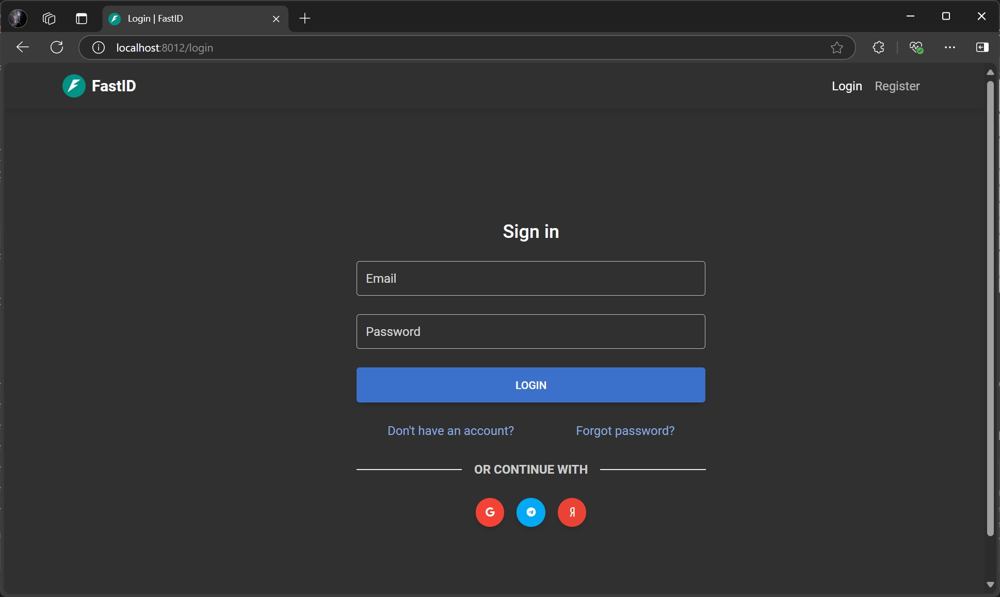
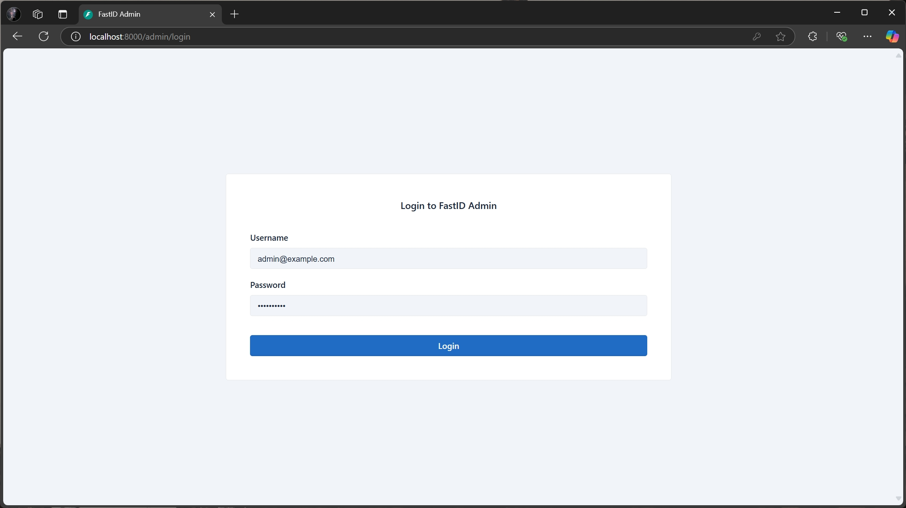
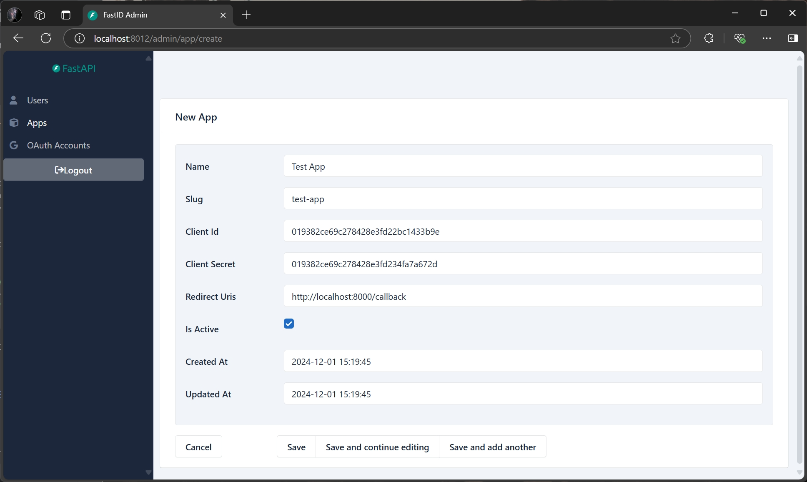
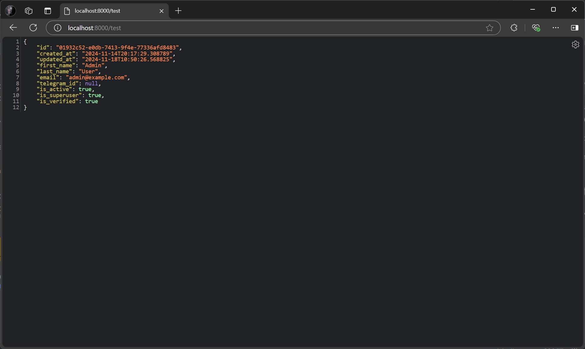
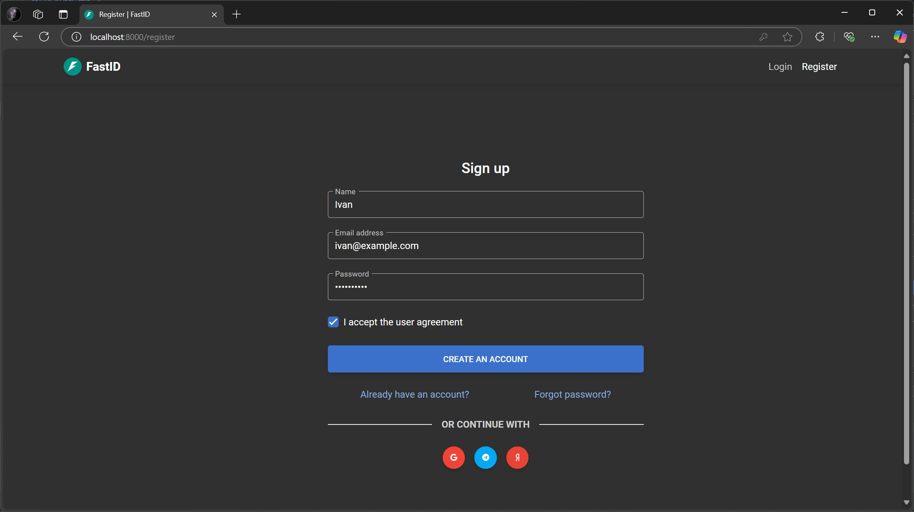
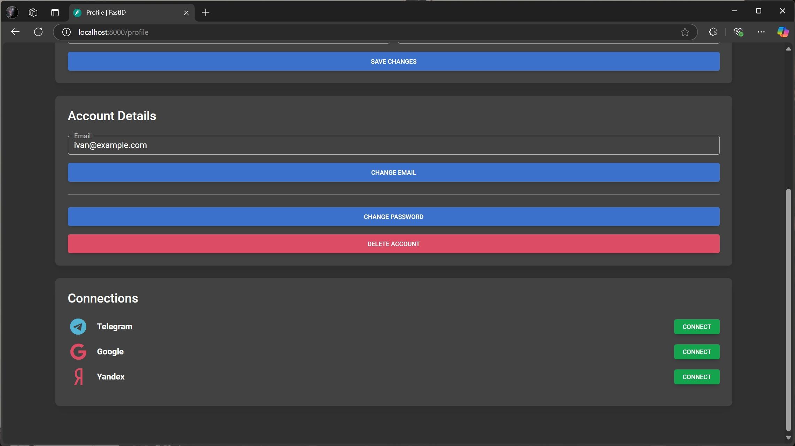
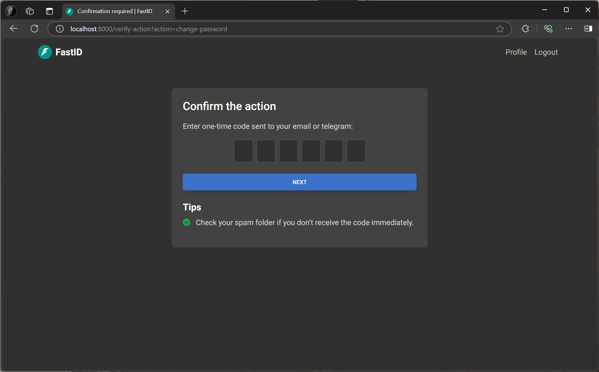
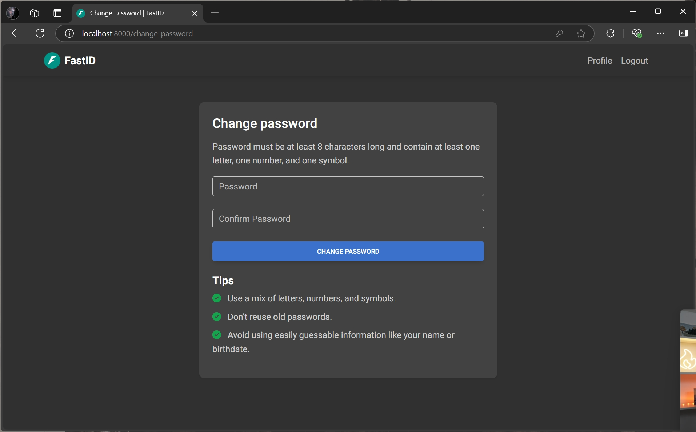
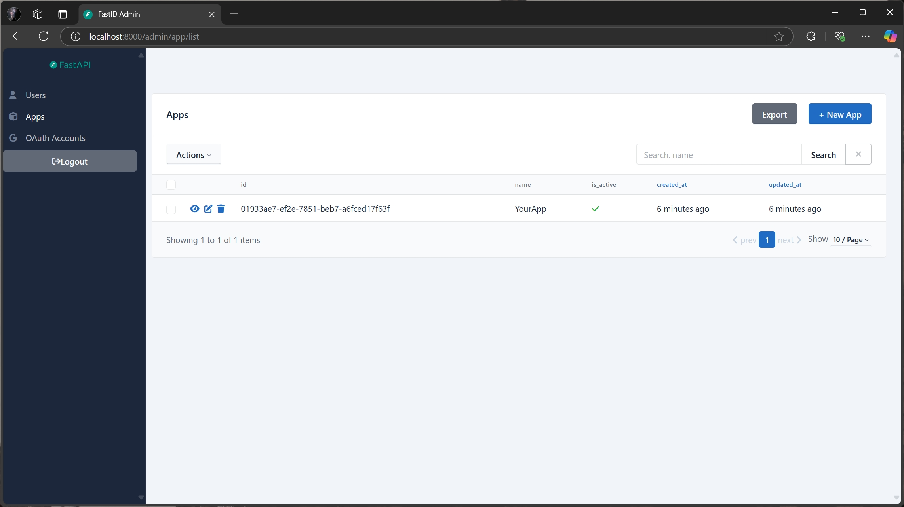

<p align="center">
    <a href="https://github.com/everysoftware/fastid"></a>
</p>
<p align="center">
    <em>FastID authentication platform, high security, lightning fast, easy-to-use, customizable.</em>
</p>

<p align="center">
    <a href="https://github.com/everysoftware/fastid/actions/workflows/test.yml" target="_blank">
        
    </a>
    <a href="https://coverage-badge.samuelcolvin.workers.dev/redirect/everysoftware/fastid" target="_blank">
        
    </a>
    <a href="https://github.com/everysoftware/fastid/actions/workflows/codeql.yml" target="_blank">
        
    </a>
    <a href="https://github.com/everysoftware/fastid/actions/workflows/test.yml" target="_blank">
        
    </a>
    <a href="https://img.shields.io/github/license/everysoftware/fastid.png" target="_blank">
        
    </a>
</p>

---

**Live Demo:** https://fastid.croce.ru

**Source Code:** https://github.com/everysoftware/fastid

---

## Features

* **Secure**: Reliable authentication without exposing user credentials to the clients (thanks
  to [OAuth 2.0](https://oauth.net/) and [OpenID Connect](https://openid.net/)).
* **Fast**: Powered by [FastAPI](https://fastapi.tiangolo.com/) (one of the fastest Python web frameworks
  available)
  and [SQLAlchemy](https://www.sqlalchemy.org/).
* **Easy-to-use**: Comes with an admin dashboard to manage users and applications. Built-in user profile pages for
  account management.
* **Quickly start**: Supports sign up with Google, Yandex, etc. Advanced integration with Telegram.
* **In touch with users**: Greets users after registration and verifies their actions via OTP.
* **Customizable**: Changes the appearance with custom templates for pages and email messages. Functionality can be
  extended with plugins.
* **Observable**: Monitor the platform's performance with 3 pills of observability: logging, metrics and tracing
  complied. Fully compatible with [OpenTelemetry](https://opentelemetry.io/).

## Installation

Clone the repository:

```bash
git clone https://github.com/everysoftware/fastid
```

Generate RSA keys:

```bash
make certs
```

Create a `.env` file based on `.env.example` and run the server:

```bash
make up
```

FastID is available at [http://localhost:8012](http://localhost:8012):



Admin panel is available at: [http://localhost:8012/admin](http://localhost:8012/admin) (default credentials:
`admin`/`admin`):



> To set up observability, you can use [this](https://github.com/everysoftware/fastapi-obs) preset.

Enjoy! 🚀

## Get Started

Login to admin panel: [http://localhost:8012/admin](http://localhost:8012/admin) and create new app to obtain
`client_id` and `client_secret`.



Here is an example of client app that uses FastID for authentication:

```python
from typing import Any, Annotated
from urllib.parse import urlencode

import httpx
from fastapi import FastAPI, Response, Request, Depends, HTTPException
from fastapi.responses import RedirectResponse

from test_client.config import settings

app = FastAPI()


@app.get("/login")
def login(request: Request) -> Any:
    params = {
        "response_type": "code",
        "client_id": settings.client_id,
        "redirect_uri": request.url_for("callback"),
    }
    url = f"{settings.fastid_url}/authorize?{urlencode(params)}"
    return RedirectResponse(url=url)


@app.get("/callback")
def callback(code: str) -> Any:
    token_data = httpx.post(
        f"{settings.fastid_url}/api/v1/token",
        headers={"Content-Type": "application/x-www-form-urlencoded"},
        data={
            "grant_type": "authorization_code",
            "client_id": settings.client_id,
            "client_secret": settings.client_secret,
            "code": code,
        },
    )
    token = token_data.json()
    response = Response(content="You are now logged in!")
    response.set_cookie("access_token", token["access_token"])
    return response


def current_user(request: Request) -> dict[str, Any]:
    token = request.cookies.get("access_token")
    if not token:
        raise HTTPException(401, "No access token")
    response = httpx.get(
        f"{settings.fastid_url}/api/v1/userinfo",
        headers={"Authorization": f"Bearer {token}"},
    )
    return response.json()


@app.get("/test")
def test(user: Annotated[dict[str, Any], Depends(current_user)]) -> Any:
    return user
```

Run the server:

```bash
fastapi dev test_client/fastid.py
```

Go to [http://localhost:8000/login](http://localhost:8000/login) to login in FastID. You will be redirected to
FastID to enter your credentials. After successful login you will be redirected back to the client app
and receive an access token.

Now you can access the protected route [http://localhost:8000/test](http://localhost:8000/test):



See the full example in the `test_client` directory.

## API Reference

API docs are available at [http://localhost:8012/api/v1/docs](http://localhost:8012/api/v1/docs)


OpenID metadata is available
at [http://localhost:8012/.well-known/openid-configuration](http://localhost:8012/.well-known/openid-configuration).

```json
{
  "issuer": "http://localhost:8012",
  "authorization_endpoint": "http://localhost:8012/authorize",
  "token_endpoint": "http://localhost:8012/api/v1/token",
  "userinfo_endpoint": "http://localhost:8012/api/v1/userinfo",
  "jwks_uri": "http://localhost:8012/.well-known/jwks.json",
  "scopes_supported": [
    "openid",
    "email",
    "name",
    "offline_access"
  ],
  "response_types_supported": [
    "code"
  ],
  "grant_types_supported": [
    "authorization_code",
    "refresh_token"
  ],
  "subject_types_supported": [
    "public"
  ],
  "id_token_signing_alg_values_supported": [
    "RS256"
  ],
  "claims_supported": [
    "iss",
    "sub",
    "aud",
    "typ",
    "iat",
    "exp",
    "name",
    "given_name",
    "family_name",
    "email",
    "email_verified"
  ]
}
```

## Screenshots












**Made with ❤️**
