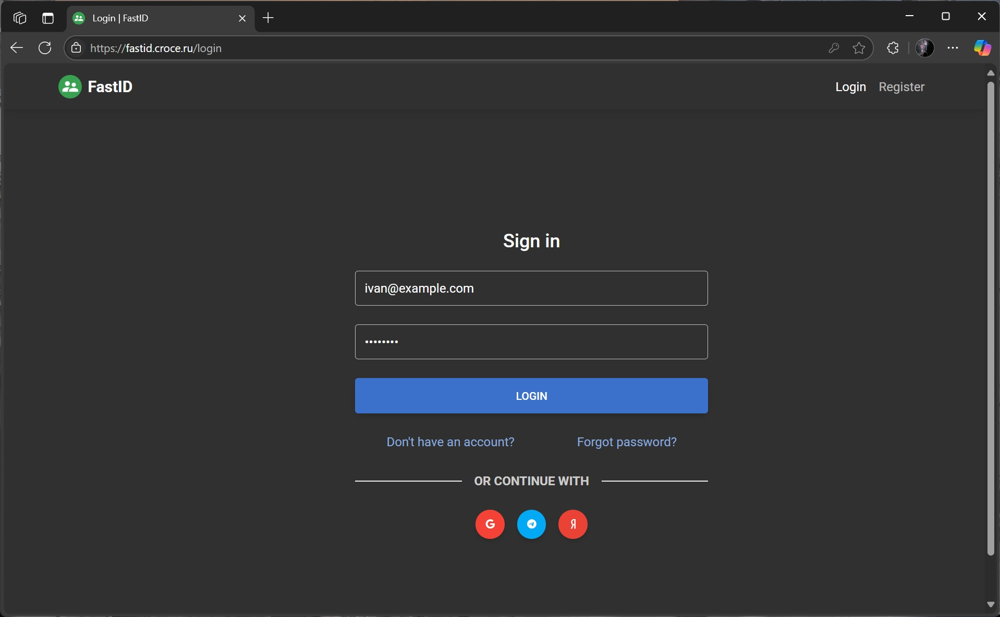
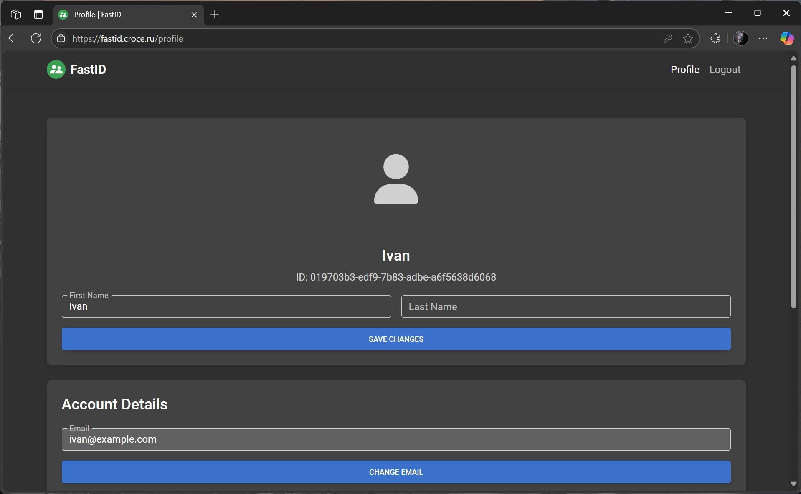
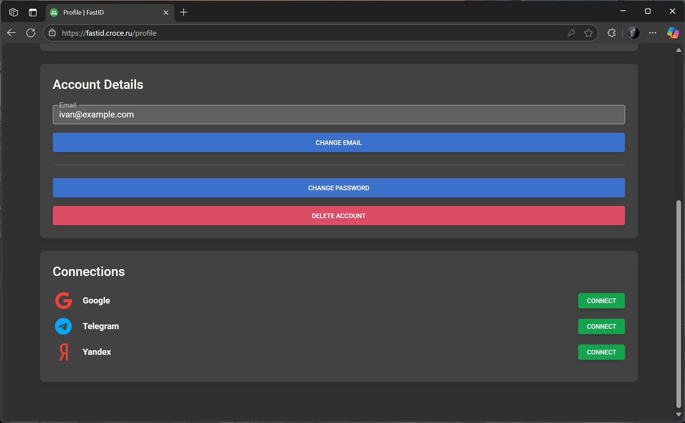
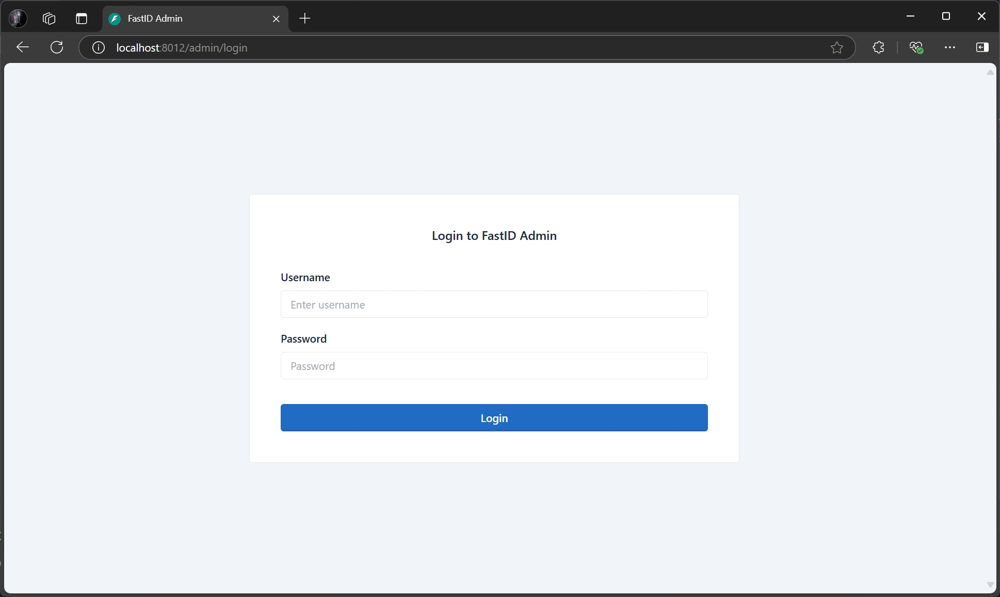
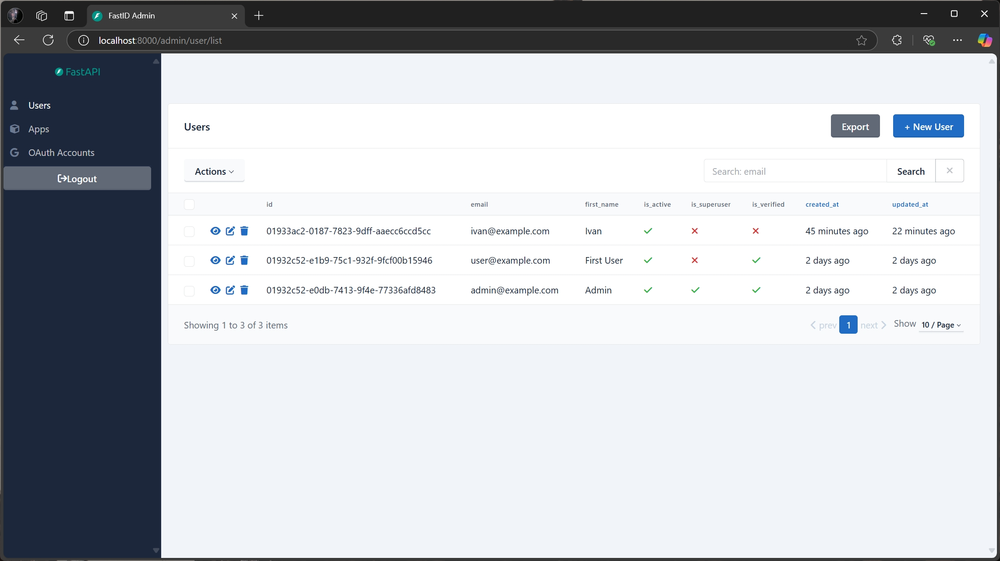
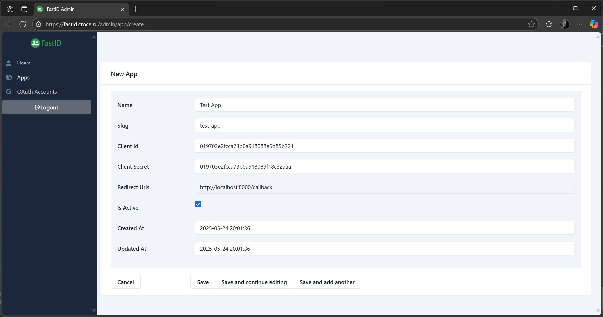
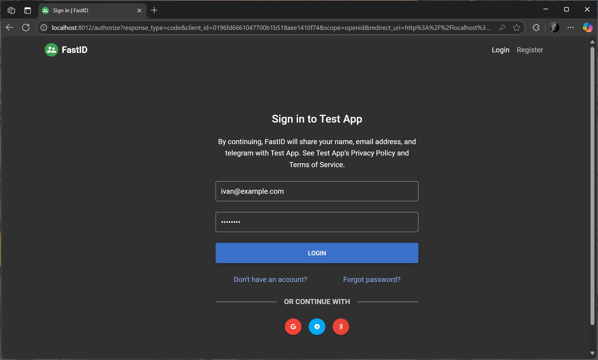
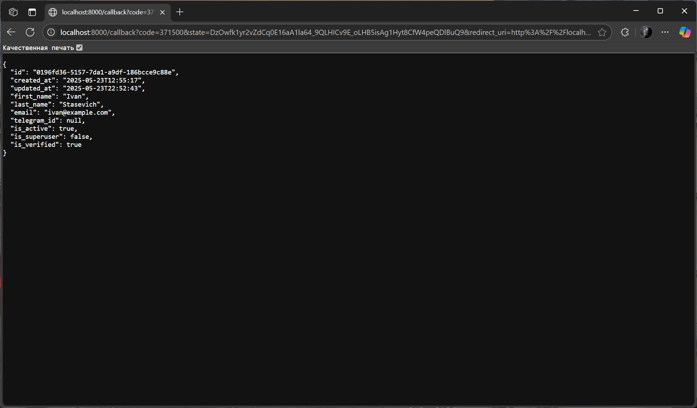

<p align="center">
    <a href="https://github.com/everysoftware/fastid"></a>
</p>
<p align="center">
    <em>FastID authentication platform, high security, lightning fast, easy-to-use, customizable.</em>
</p>

<p align="center">
    <a href="https://github.com/everysoftware/fastid/actions/workflows/test.yml" target="_blank">
        
    </a>
    <a href="https://coverage-badge.samuelcolvin.workers.dev/redirect/everysoftware/fastid" target="_blank">
        
    </a>
    <a href="https://github.com/everysoftware/fastid/actions/workflows/codeql.yml" target="_blank">
        
    </a>
    <a href="https://github.com/everysoftware/fastid/actions/workflows/test.yml" target="_blank">
        
    </a>
    <a href="https://img.shields.io/github/license/everysoftware/fastid.png" target="_blank">
        
    </a>
</p>

---

**Live Demo:** [https://fastid.croce.ru](https://fastid.croce.ru)

**Documentation:** [https://everysoftware.github.io/fastid](https://everysoftware.github.io/fastid)

**Source Code:** [https://github.com/everysoftware/fastid](https://github.com/everysoftware/fastid)

---

## Features

* **Secure**: Reliable authentication without exposing user credentials to the clients (thanks
  to [OAuth 2.0](https://oauth.net/) and [OpenID Connect](https://openid.net/)).
* **Fast**: Powered by [FastAPI](https://fastapi.tiangolo.com/) (one of the fastest Python web frameworks
  available)
  and [SQLAlchemy](https://www.sqlalchemy.org/).
* **Easy-to-use**: Comes with an admin dashboard to manage users and applications. Built-in user profile pages for
  account management.
* **Quickly start**: Supports sign up with Google, Yandex, etc. Advanced integration with Telegram.
* **In touch with users**: Greets users after registration and verifies their actions via OTP.
* **Customizable**: Changes the appearance with custom templates for pages and email messages. Functionality can be
  extended with plugins.
* **Observable**: Monitor the platform's performance with 3 pills of observability: logging, metrics and tracing
  complied. Fully compatible with [OpenTelemetry](https://opentelemetry.io/).

## Installation

Clone the repository:

```bash
git clone https://github.com/everysoftware/fastid
```

Generate RSA keys:

```bash
make certs
```

Create a `.env` file based on `.env.example` and run the server:

```bash
make up
```

FastID is available at [http://localhost:3012](http://localhost:8012):





Admin panel is available at: [http://localhost:4012/admin](http://localhost:8012/admin):




> To set up observability, you can use [this](https://github.com/everysoftware/fastapi-obs) preset.

Enjoy! 🚀

## Get Started

To start using FastID, you need to [create](http://localhost:8012/admin/app/create) an application in the admin panel.
This will allow you to use FastID for
authentication in your application.



Once you have created an application, you can use the standard OAuth 2.0 flow to authenticate users. FastID supports the
authorization code flow, which is the most secure and recommended way to authenticate users.

Here is an example of how to use FastID for authentication in a Python application using the
[FastAPI](https://fastapi.tiangolo.com/) framework and the [httpx](https://www.python-httpx.org/) library.

```python
from typing import Any
from urllib.parse import urlencode

import httpx
from fastapi import FastAPI, Request
from fastapi.responses import RedirectResponse

FASTID_URL = "http://localhost:8012"
FASTID_CLIENT_ID = ...
FASTID_CLIENT_SECRET = ...

app = FastAPI()


@app.get("/login")
def login(request: Request) -> Any:
    params = {
        "response_type": "code",
        "client_id": FASTID_CLIENT_ID,
        "redirect_uri": request.url_for("callback"),
        "scope": "openid",
    }
    url = f"{FASTID_URL}/authorize?{urlencode(params)}"
    return RedirectResponse(url=url)


@app.get("/callback")
def callback(code: str) -> Any:
    response = httpx.post(
        f"{FASTID_URL}/api/v1/token",
        headers={"Content-Type": "application/x-www-form-urlencoded"},
        data={
            "grant_type": "authorization_code",
            "client_id": FASTID_CLIENT_ID,
            "client_secret": FASTID_CLIENT_SECRET,
            "code": code,
        },
    )
    token = response.json()["access_token"]
    response = httpx.get(
        f"{FASTID_URL}/api/v1/userinfo",
        headers={"Authorization": f"Bearer {token}"},
    )
    return response.json()
```

In this example, we define two routes:

1. `/login`: Redirects the user to the FastID authorization page.
2. `/callback`: Handles the callback from FastID after the user has logged in. It exchanges the authorization code for
   an access token and retrieves the user's information.

Run the FastAPI application:

```bash
fastapi dev examples/httpx.py
```

Visit [http://localhost:8000/login](http://localhost:8000/login) to start the authentication process. You will be
redirected to the FastID login page, where you can log in with your credentials or use a third-party provider.



After logging in, you will be redirected to the `/callback` route, where you can access the user's information.



**Made with ❤️**
