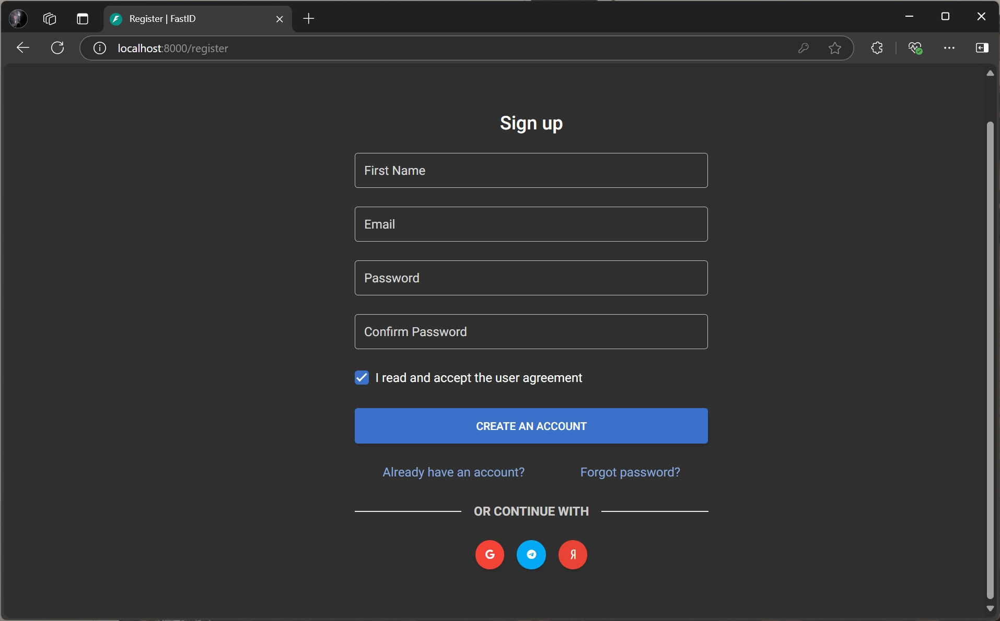
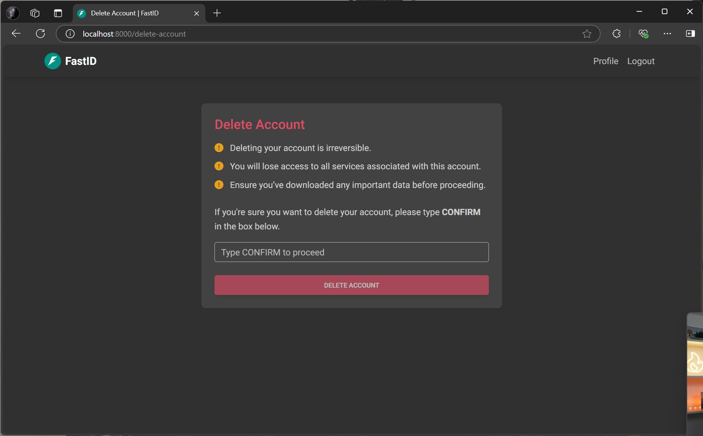

<p align="center">
    <a href="https://github.com/everysoftware/fastid"></a>
</p>
<p align="center">
    <em>FastID authentication platform, high security, lightning fast, easy-to-use, customizable.</em>
</p>

<p align="center">
    <a href="https://github.com/everysoftware/fastid/actions/workflows/test.yml" target="_blank">
        
    </a>
    <a href="https://coverage-badge.samuelcolvin.workers.dev/redirect/everysoftware/fastid" target="_blank">
        
    </a>
    <a href="https://github.com/everysoftware/fastid/actions/workflows/codeql.yml" target="_blank">
        
    </a>
    <a href="https://github.com/everysoftware/fastid/actions/workflows/test.yml" target="_blank">
        
    </a>
    <a href="https://img.shields.io/github/license/everysoftware/fastid.png" target="_blank">
        
    </a>
</p>

---

**Live Demo:** https://fastid.croce.ru

**Documentation:** https://everysoftware.github.io/fastid

**Source Code:** https://github.com/everysoftware/fastid

---

## Features

* **Secure**: Reliable authentication without exposing user credentials to the clients (thanks
  to [OAuth 2.0](https://oauth.net/) and [OpenID Connect](https://openid.net/)).
* **Fast**: Powered by [FastAPI](https://fastapi.tiangolo.com/) (one of the fastest Python web frameworks
  available)
  and [SQLAlchemy](https://www.sqlalchemy.org/).
* **Easy-to-use**: Comes with an admin dashboard to manage users and applications. Built-in user profile pages for
  account management.
* **Quickly start**: Supports sign up with Google, Yandex, etc. Advanced integration with Telegram.
* **In touch with users**: Greets users after registration and verifies their actions via OTP.
* **Customizable**: Changes the appearance with custom templates for pages and email messages. Functionality can be
  extended with plugins.
* **Observable**: Monitor the platform's performance with 3 pills of observability: logging, metrics and tracing
  complied. Fully compatible with [OpenTelemetry](https://opentelemetry.io/).

## Installation

Clone the repository:

```bash
git clone https://github.com/everysoftware/fastid
```

Generate RSA keys:

```bash
make certs
```

Create a `.env` file based on `.env.example` and run the server:

```bash
make up
```

FastID is available at [http://localhost:8012](http://localhost:8012):


Admin panel is available at: [http://localhost:8012/admin](http://localhost:8012/admin) (default credentials:
`admin`/`admin`):


> To set up observability, you can use [this](https://github.com/everysoftware/fastapi-obs) preset.

Enjoy! 🚀

## Screenshots








**Made with ❤️**
