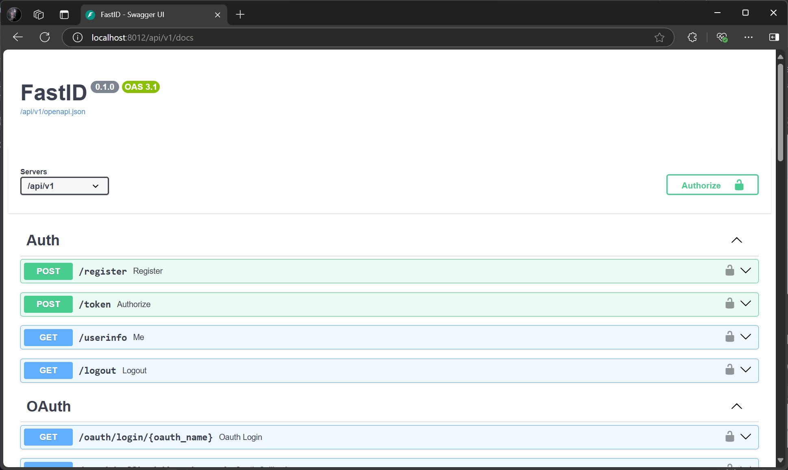

# API Reference

API docs are available at [http://localhost:8012/api/v1/docs](http://localhost:8012/api/v1/docs)



OpenID metadata is available
at [http://localhost:8012/.well-known/openid-configuration](http://localhost:8012/.well-known/openid-configuration).

```json
{
  "issuer": "http://localhost:8012",
  "authorization_endpoint": "http://localhost:8012/authorize",
  "token_endpoint": "http://localhost:8012/api/v1/token",
  "userinfo_endpoint": "http://localhost:8012/api/v1/userinfo",
  "jwks_uri": "http://localhost:8012/.well-known/jwks.json",
  "scopes_supported": [
    "openid",
    "email",
    "name",
    "offline_access"
  ],
  "response_types_supported": [
    "code"
  ],
  "grant_types_supported": [
    "authorization_code",
    "refresh_token"
  ],
  "subject_types_supported": [
    "public"
  ],
  "id_token_signing_alg_values_supported": [
    "RS256"
  ],
  "claims_supported": [
    "iss",
    "sub",
    "aud",
    "typ",
    "iat",
    "exp",
    "name",
    "given_name",
    "family_name",
    "email",
    "email_verified"
  ]
}
```
