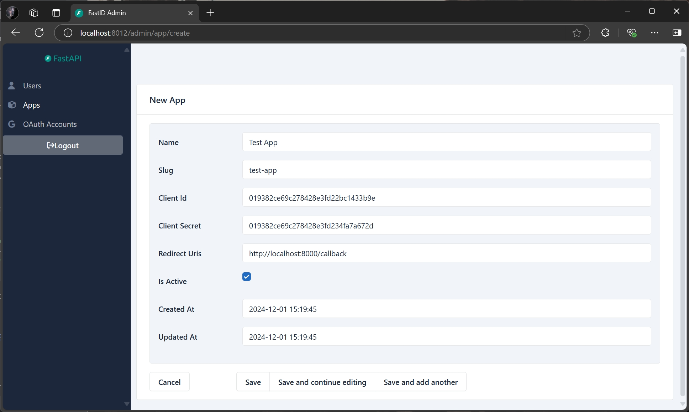
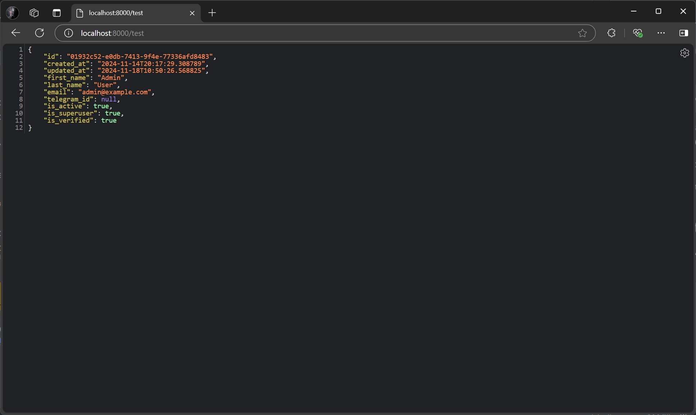

# Get Started

To start using FastID, you need to [create](http://localhost:8012/admin/app/create) an application in the admin panel.
This will allow you to use FastID for
authentication in your application.



Once you have created an application, you can use the standard OAuth 2.0 flow to authenticate users. FastID supports the
authorization code flow, which is the most secure and recommended way to authenticate users.

Here is an example of how to use FastID for authentication in a Python application using the
[FastAPI](https://fastapi.tiangolo.com/) framework and the [httpx](https://www.python-httpx.org/) library.

```python
from typing import Any, Annotated
from urllib.parse import urlencode

import httpx
from fastapi import FastAPI, Response, Request, Depends, HTTPException, status
from fastapi.responses import RedirectResponse

FASTID_URL = "http://localhost:8012"
FASTID_CLIENT_ID = ...
FASTID_CLIENT_SECRET = ...

app = FastAPI()


@app.get("/login")
def login(request: Request) -> Any:
    params = {
        "response_type": "code",
        "client_id": FASTID_CLIENT_ID,
        "redirect_uri": request.url_for("callback"),
    }
    url = f"{FASTID_URL}/authorize?{urlencode(params)}"
    return RedirectResponse(url=url)


@app.get("/callback")
def callback(code: str) -> Any:
    token_data = httpx.post(
        f"{FASTID_URL}/api/v1/token",
        headers={"Content-Type": "application/x-www-form-urlencoded"},
        data={
            "grant_type": "authorization_code",
            "client_id": FASTID_CLIENT_ID,
            "client_secret": FASTID_CLIENT_SECRET,
            "code": code,
        },
    )
    token = token_data.json()
    response = Response(content="You are now logged in!")
    response.set_cookie("access_token", token["access_token"])
    return response


def current_user(request: Request) -> dict[str, Any]:
    token = request.cookies.get("access_token")
    if not token:
        raise HTTPException(status.HTTP_401_UNAUTHORIZED, "No access token")
    response = httpx.get(
        f"{FASTID_URL}/api/v1/userinfo",
        headers={"Authorization": f"Bearer {token}"},
    )
    return response.json()


@app.get("/test")
def test(user: Annotated[dict[str, Any], Depends(current_user)]) -> Any:
    return user
```

In this example, we define three routes:

1. `/login`: Redirects the user to the FastID authorization page.
2. `/callback`: Handles the callback from FastID after the user has logged in. It exchanges the authorization code for
   an access token and sets it as a cookie.
3. `/test`: A protected route that requires the user to be logged in. It retrieves the user's information from FastID
   using the access token.

Run the FastAPI application:

```bash
fastapi dev examples/httpx.py
```

Visit [http://localhost:8000/login](http://localhost:8000/login) to start the authentication process. After logging in,
you will be redirected to the `/callback` route, where the access token will be set as a cookie. You can then
access the `/test` route to retrieve the user's information.


