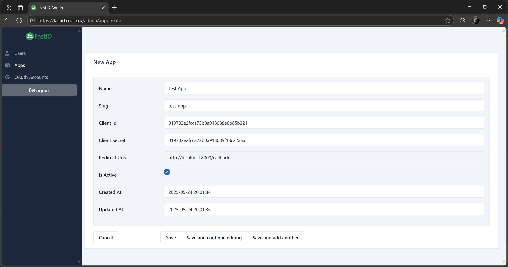
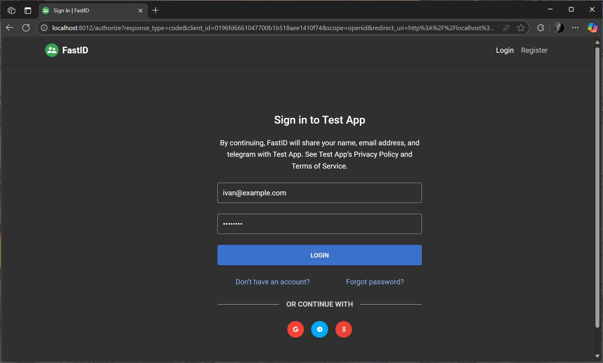
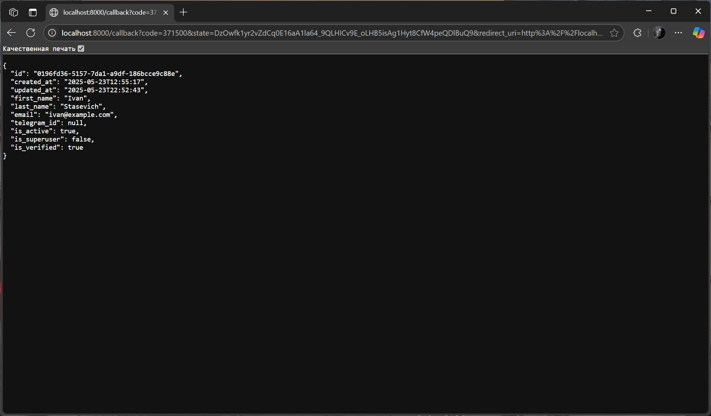

# Get Started

## Create App

To start using FastID, you need to [create](http://localhost:8012/admin/app/create) an application in the admin panel.
This will allow you to use FastID for
authentication in your application.



Once you have created an application, you can use the standard OAuth 2.0 flow to authenticate users. FastID supports the
authorization code flow, which is the most secure and recommended way to authenticate users.

## HTTPX Example

Here is an example of how to use FastID for authentication in a Python application using the
[FastAPI](https://fastapi.tiangolo.com/) framework and the [httpx](https://www.python-httpx.org/) library.

```python
from typing import Any
from urllib.parse import urlencode

import httpx
from fastapi import FastAPI, Request
from fastapi.responses import RedirectResponse

FASTID_URL = "http://localhost:8012"
FASTID_CLIENT_ID = ...
FASTID_CLIENT_SECRET = ...

app = FastAPI()


@app.get("/login")
def login(request: Request) -> Any:
    params = {
        "response_type": "code",
        "client_id": FASTID_CLIENT_ID,
        "redirect_uri": request.url_for("callback"),
        "scope": "openid",
    }
    url = f"{FASTID_URL}/authorize?{urlencode(params)}"
    return RedirectResponse(url=url)


@app.get("/callback")
def callback(code: str) -> Any:
    response = httpx.post(
        f"{FASTID_URL}/api/v1/token",
        headers={"Content-Type": "application/x-www-form-urlencoded"},
        data={
            "grant_type": "authorization_code",
            "client_id": FASTID_CLIENT_ID,
            "client_secret": FASTID_CLIENT_SECRET,
            "code": code,
        },
    )
    token = response.json()["access_token"]
    response = httpx.get(
        f"{FASTID_URL}/api/v1/userinfo",
        headers={"Authorization": f"Bearer {token}"},
    )
    return response.json()

```

## FastLink Example

You can also use the [FastLink](https://github.com/everysoftware/fastlink) as a faster and safer way:

```python
from typing import Annotated, Any

from fastapi import Depends, FastAPI
from fastapi.responses import RedirectResponse
from fastlink import FastLink
from fastlink.schemas import OAuth2Callback, ProviderMeta

app = FastAPI()
fastid = FastLink(
    ProviderMeta(server_url="http://localhost:8012", scope=["openid"]),
    ...,  # Client ID
    ...,  # Client Secret
    "http://localhost:8000/callback",
)


@app.get("/login")
async def login() -> Any:
    async with fastid:
        url = await fastid.login_url()
        return RedirectResponse(url=url)


@app.get("/callback")
async def callback(call: Annotated[OAuth2Callback, Depends()]) -> Any:
    async with fastid:
        return await fastid.callback_raw(call)
```

## Results

In this example, we define two routes:

1. `/login`: Redirects the user to the FastID authorization page.
2. `/callback`: Handles the callback from FastID after the user has logged in. It exchanges the authorization code for
   an access token and retrieves the user's information.

Run the FastAPI application:

```bash
fastapi dev examples/httpx.py
```

Visit [http://localhost:8000/login](http://localhost:8000/login) to start the authentication process. You will be
redirected to the FastID login page, where you can log in with your credentials or use a third-party provider.



After logging in, you will be redirected to the `/callback` route, where you can access the user's information.


