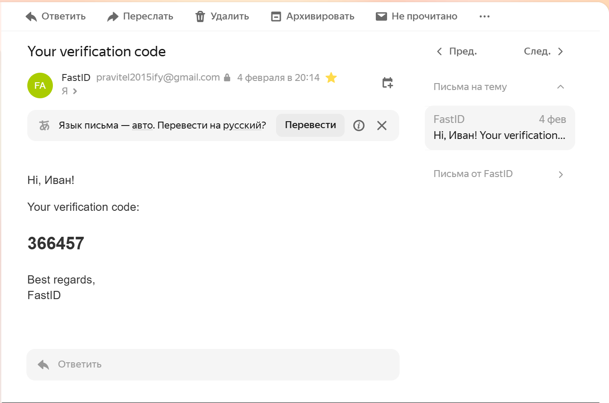
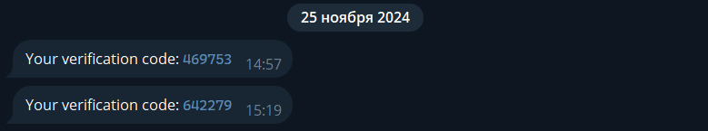

# Notifications

FastID supports sending notifications to users via **E-mail** and **Telegram**. This is useful for sending welcome
messages, OTPs, and other important information.

## E-mail

You can use any SMTP server to send emails. The following example uses Gmail's SMTP server.

Add the following lines to your `.env` file:

```
FASTID_SMTP_ENABLED=1
FASTID_SMTP_SSL=1
FASTID_SMTP_HOST=...
FASTID_SMTP_PORT=465
FASTID_SMTP_AUTH=1
FASTID_SMTP_USERNAME=...
FASTID_SMTP_PASSWORD=...
```



## Telegram

Visit [https://t.me/BotFather](https://t.me/BotFather) to create a new bot and obtain the token.

Add the following to your `.env` file:

```
FASTID_TELEGRAM_NOTIFICATION_ENABLED=1
FASTID_TELEGRAM_BOT_TOKEN=...
```


