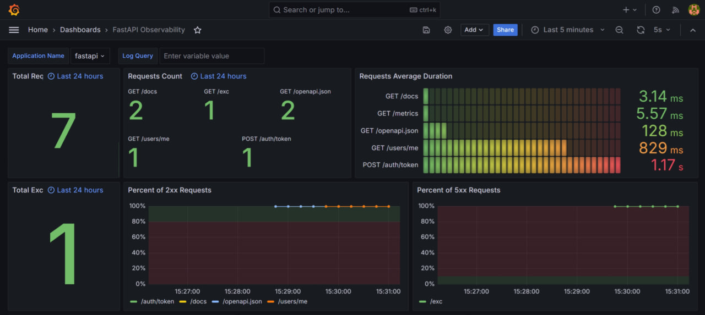
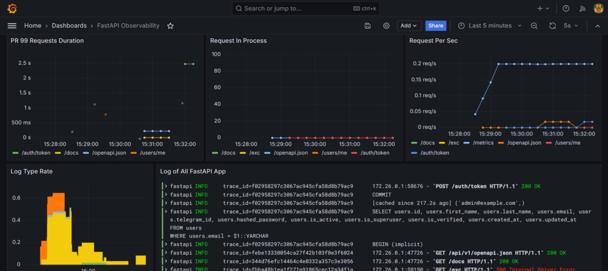

# Observability

FastID provides built-in support for observability using **Grafana**, **Prometheus**,
**Tempo**, and **Loki**. This allows you to monitor your application performance and log data effectively.

## Setup

Repository containing the required infrastructure and sample
dashboards: [https://github.com/everysoftware/fastid-observability](https://github.com/everysoftware/fastid-observability).

To use the observability features, you need to have the following environment variables set in your `.env` file:

```
FASTID_METRICS_ENABLED=1
FASTID_TRACING_ENABLED=1
FASTID_TEMPO_URL="http://tempo:4317"
```



