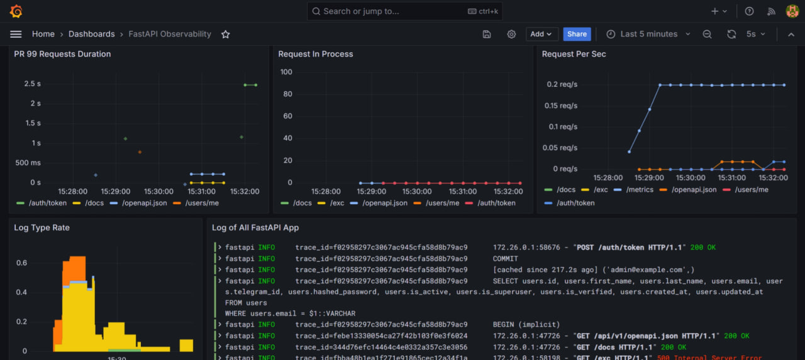

# Observability

FastID provides built-in support for observability using **Grafana**, **Prometheus**,
**Tempo**, and **Loki**. This allows you to monitor your application performance and log data effectively.

## Setup

Repository containing the required infrastructure and sample
dashboards: [https://github.com/everysoftware/fastapi-obs](https://github.com/everysoftware/fastapi-obs).

To use the observability features, you need to have the following environment variables set in your `.env` file:

```
OBS_ENABLED=1
OBS_TEMPO_URL="http://TEMPO_URL:4317"
```



