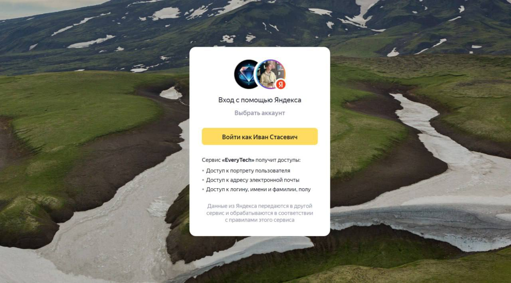
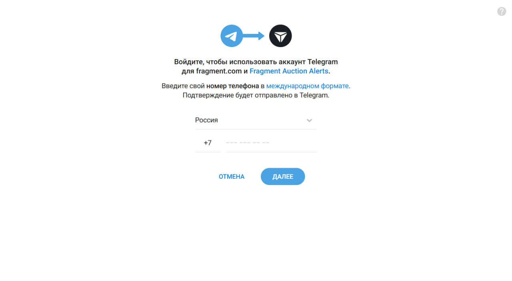

# Social Login

Social login allows users to authenticate using their existing accounts from popular platforms like **Google**,
**Yandex**, **Telegram** and others.

To enable social login, you need to
register your application with the respective social platform and obtain client credentials. Then, you can configure
FastID to use these credentials.

## Google

Visit [https://console.cloud.google.com/apis/credentials](https://console.cloud.google.com/apis/credentials) to obtain
client credentials.

Add the following to your `.env` file:

```
GOOGLE_ENABLED=1
GOOGLE_CLIENT_ID=...
GOOGLE_CLIENT_SECRET=...
```


## Yandex

Visit [https://oauth.yandex.ru](https://oauth.yandex.ru) to obtain client credentials.

Add the following to your `.env` file:

```
YANDEX_ENABLED=1
YANDEX_CLIENT_ID=...
YANDEX_CLIENT_SECRET=...
```



## Telegram

Visit [https://t.me/BotFather](https://t.me/BotFather) to create a new bot and obtain the token. Set the domain for the
bot in the BotFather
settings.

Add the following to your `.env` file:

```
TELEGRAM_ENABLED=1
TELEGRAM_BOT_TOKEN=...
```



## Other Providers

FastID uses [FastLink](https://github.com/everysoftware/fastlink) for social login. You can implement any provider
using the FastLink API. The process is similar to the ones described above.
