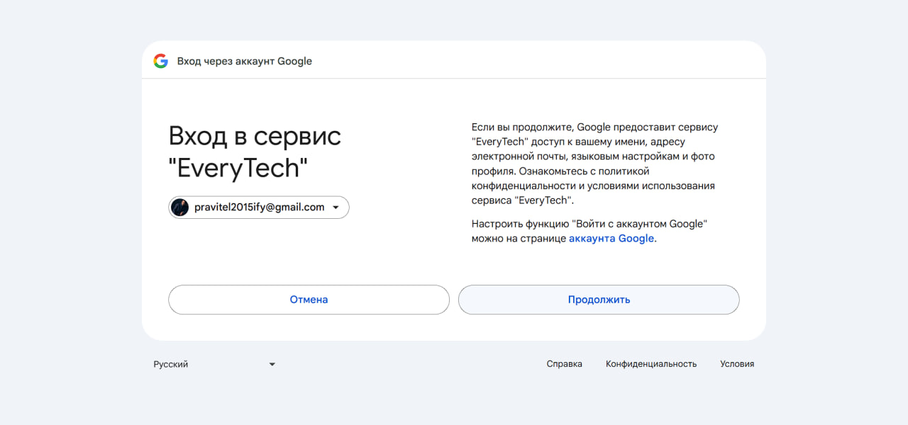
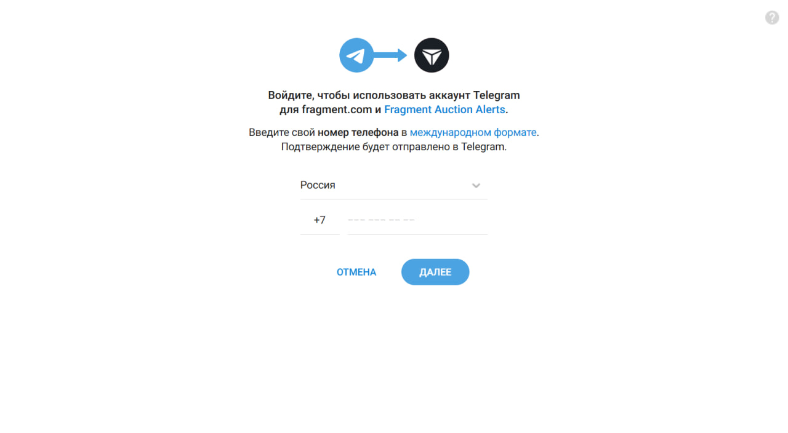

# Social Login

Social login allows users to authenticate using their existing accounts from popular platforms like **Google**,
**Yandex**, **Telegram** and others.

To enable social login, register your application with the respective social platform and obtain client credentials.
Then open **Admin → Settings → OAuth Providers**, edit the provider, enter its credentials, and enable it. All supported
providers are created in a disabled state. OAuth credentials are no longer read from environment variables.

## Google

Visit [https://console.cloud.google.com/apis/credentials](https://console.cloud.google.com/apis/credentials) to obtain
client credentials.

In the Admin panel, enter the Google **Client ID** and **Client Secret**, then enable Google.

## Yandex

Visit [https://oauth.yandex.ru](https://oauth.yandex.ru) to obtain client credentials.

In the Admin panel, enter the Yandex **Client ID** and **Client Secret**, then enable Yandex.

## Telegram

Visit [https://t.me/BotFather](https://t.me/BotFather) to create a new bot and obtain the token. Set the domain for the
bot in the BotFather
settings.

In the Admin panel, put the bot token in **Client Secret** and enable Telegram. Telegram does not use **Client ID**.

